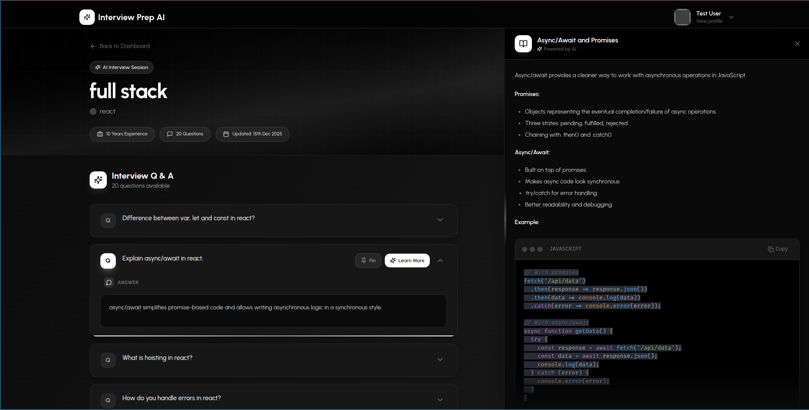

# Interview Prep AI 🚀



A comprehensive AI-powered interview preparation platform built with React and Node.js. This application helps users prepare for interviews with personalized questions, real-time feedback, and performance analytics.

## ✨ Features

### Core Functionality
- **🤖 AI-Powered Questions**: Get personalized interview questions tailored to your role and experience level using advanced AI technology
- **⚡ Real-time Feedback**: Receive instant feedback on your answers with detailed explanations and improvement suggestions
- **📊 Session Management**: Organize and track your interview preparation sessions with comprehensive progress tracking
- **📚 Question Bank**: Access a vast library of interview questions across different domains and difficulty levels
- **📈 Performance Analytics**: Analyze your interview performance with detailed statistics and improvement recommendations

### User Experience
- **🎨 Modern UI**: Beautiful, responsive interface with smooth animations using Framer Motion
- **🔐 Secure Authentication**: JWT-based authentication system with bcrypt password hashing
- **📱 Responsive Design**: Optimized for all devices and screen sizes
- **🎯 User-Friendly**: Intuitive navigation and clean interface design

## 🏗️ Project Structure

```
interpre/
├── Backend/                 # Node.js/Express backend
│   ├── config/
│   │   └── db.js          # MongoDB connection
│   ├── controllers/
│   │   ├── aiController.js      # AI integration (Google GenAI, OpenAI)
│   │   ├── authController.js    # Authentication logic
│   │   ├── questionController.js # Question management
│   │   └── sessionController.js # Session management
│   ├── middlewares/
│   │   ├── authMiddlewares.js   # JWT authentication middleware
│   │   └── uploadMiddlewares.js # File upload handling
│   ├── models/
│   │   ├── Question.js     # Question data model
│   │   ├── Session.js      # Session data model
│   │   └── User.js         # User data model
│   ├── routes/
│   │   ├── authRoutes.js        # Authentication endpoints
│   │   ├── questionRoutes.js    # Question endpoints
│   │   └── sessionRoutes.js     # Session endpoints
│   ├── uploads/            # File upload directory
│   ├── utils/
│   │   └── prompts.js      # AI prompt templates
│   ├── package.json        # Backend dependencies
│   └── server.js          # Main server file
│
├── Frontend/              # React frontend
│   ├── public/            # Static assets
│   ├── src/
│   │   ├── assets/
│   │   │   ├── landingpage.png      # Hero section image
│   │   │   └── react.svg
│   │   ├── components/
│   │   │   ├── Cards/               # Reusable card components
│   │   │   ├── Inputs/              # Form input components
│   │   │   ├── layouts/             # Layout components
│   │   │   ├── Loader/              # Loading components
│   │   │   ├── DeleteAlertContent.jsx
│   │   │   ├── Drawer.jsx
│   │   │   └── Modal.jsx
│   │   ├── context/
│   │   │   └── userContext.jsx      # User state management
│   │   ├── pages/
│   │   │   ├── Auth/                # Login/Signup pages
│   │   │   ├── Home/                # Dashboard and forms
│   │   │   ├── InterviewPrep/       # Interview preparation
│   │   │   └── LandingPage.jsx      # Main landing page
│   │   ├── utils/
│   │   │   ├── apiPaths.js          # API endpoint constants
│   │   │   ├── axiosInstance.js     # Axios configuration
│   │   │   ├── data.js              # Static data and configurations
│   │   │   ├── helper.js            # Utility functions
│   │   │   └── uploadImage.js       # Image upload utilities
│   │   ├── App.jsx                  # Main app component
│   │   ├── index.css               # Global styles
│   │   └── main.jsx                # App entry point
│   ├── package.json                # Frontend dependencies
│   ├── vite.config.js             # Vite configuration
│   └── README.md                  # Frontend-specific README
│
└── .gitignore                     # Git ignore rules
```

## 🛠️ Technology Stack

### Frontend
- **React 19** - Modern React with hooks and functional components
- **Vite** - Fast build tool and development server
- **React Router DOM 7** - Client-side routing
- **Framer Motion** - Smooth animations and transitions
- **Tailwind CSS 4** - Utility-first CSS framework
- **React Icons** - Icon library (Lucide React icons)
- **Axios** - HTTP client for API requests
- **React Hot Toast** - Toast notifications
- **Moment.js** - Date/time handling
- **React Markdown** - Markdown rendering
- **React Syntax Highlighter** - Code syntax highlighting

### Backend
- **Node.js** - JavaScript runtime
- **Express.js** - Web application framework
- **MongoDB** - NoSQL database
- **Mongoose** - MongoDB object modeling
- **JWT** - JSON Web Tokens for authentication
- **bcryptjs** - Password hashing
- **Multer** - File upload middleware
- **CORS** - Cross-Origin Resource Sharing
- **Google GenAI** - Google AI integration
- **OpenAI** - OpenAI API integration
- **Axios** - HTTP client
- **dotenv** - Environment variable management

## 🚀 Getting Started

### Prerequisites
- Node.js (v16 or higher)
- MongoDB (local or cloud instance)
- npm or yarn package manager

### Installation

1. **Clone the repository**
   ```bash
   git clone <repository-url>
   cd interpre
   ```

2. **Backend Setup**
   ```bash
   cd Backend
   npm install
   ```

3. **Frontend Setup**
   ```bash
   cd Frontend
   npm install
   ```

### Environment Configuration

1. **Backend Environment Variables**
   Create a `.env` file in the `Backend` directory:
   ```env
   PORT=5000
   MONGODB_URI=mongodb://localhost:27017/interview-prep
   JWT_SECRET=your_jwt_secret_here
   OPENAI_API_KEY=your_openai_api_key_here
   NODE_ENV=development
   ```

2. **Frontend Configuration**
   The frontend is configured to work with the backend API. Update `src/utils/apiPaths.js` if your backend runs on a different port.

### Running the Application

1. **Start the Backend Server**
   ```bash
   cd Backend
   npm run dev  # For development with nodemon
   # or
   npm start    # For production
   ```

2. **Start the Frontend Development Server**
   ```bash
   cd Frontend
   npm run dev
   ```

3. **Access the Application**
   - Frontend: http://localhost:5173
   - Backend API: http://localhost:5000

## 📱 How to Use

### 1. Landing Page
- Visit the homepage to see the application's features
- View testimonials and key statistics
- Click "Get Started Free" to begin

### 2. Authentication
- **Sign Up**: Create a new account with email and password
- **Sign In**: Log into your existing account
- **Password Security**: All passwords are securely hashed using bcrypt

### 3. Dashboard
- **Create Session**: Start a new interview preparation session
- **View Sessions**: See all your past preparation sessions
- **Track Progress**: Monitor your improvement over time

### 4. Interview Preparation
- **AI Questions**: Receive personalized interview questions
- **Answer Practice**: Practice your responses
- **AI Feedback**: Get detailed feedback on your answers
- **Concept Explanations**: Understand key concepts with AI explanations

### 5. Session Management
- **Save Progress**: All sessions are automatically saved
- **Review History**: Access previous sessions for review
- **Performance Analytics**: View detailed performance metrics

## 🎯 Key Components

### Frontend Components
- **LandingPage.jsx**: Main landing page with hero section, features, and testimonials
- **Dashboard.jsx**: User dashboard for session management
- **InterviewPrep.jsx**: Main interview preparation interface
- **Login.jsx & SignUp.jsx**: Authentication forms
- **QuestionCard.jsx**: Reusable question display component
- **ProfileInfoCard.jsx**: User profile display component

### Backend Controllers
- **aiController.js**: Handles AI integration for questions and feedback
- **authController.js**: Manages user authentication and authorization
- **questionController.js**: CRUD operations for questions
- **sessionController.js**: Session creation and management

### API Endpoints

#### Authentication
- `POST /api/auth/signup` - User registration
- `POST /api/auth/login` - User login

#### Sessions
- `GET /api/sessions` - Get user's sessions
- `POST /api/sessions` - Create new session
- `PUT /api/sessions/:id` - Update session
- `DELETE /api/sessions/:id` - Delete session

#### Questions
- `GET /api/questions` - Get questions
- `POST /api/questions` - Create question
- `PUT /api/questions/:id` - Update question
- `DELETE /api/questions/:id` - Delete question

#### AI Features
- `POST /api/ai/generate-questions` - Generate AI-powered questions
- `POST /api/ai/generate-explanation` - Get AI explanations

## 🔒 Security Features

- **JWT Authentication**: Secure token-based authentication
- **Password Hashing**: bcryptjs for secure password storage
- **CORS Protection**: Configured CORS for API security
- **Environment Variables**: Sensitive data stored in environment variables
- **Input Validation**: Server-side input validation and sanitization

## 🎨 Design Features

### Animations
- **Framer Motion**: Smooth page transitions and component animations
- **Hover Effects**: Interactive buttons and cards
- **Loading States**: Skeleton loaders and spinners
- **Floating Elements**: Subtle floating animations on the hero section

### UI/UX
- **Responsive Design**: Mobile-first responsive layout
- **Modern Aesthetics**: Clean, professional design
- **Accessibility**: Proper ARIA labels and keyboard navigation
- **Performance**: Optimized images and lazy loading


## 🤝 Contributing

1. Fork the repository
2. Create a feature branch: `git checkout -b feature-name`
3. Commit your changes: `git commit -m 'Add some feature'`
4. Push to the branch: `git push origin feature-name`
5. Submit a pull request

## 📄 License

This project is licensed under the ISC License - see the package.json files for details.

## 👨‍💻 Author

**Aditya Pundir**
- Built with  using React, Node.js, and AI technologies


**Ready to ace your next interview? Start preparing with Interview Prep AI today!** 🎯
